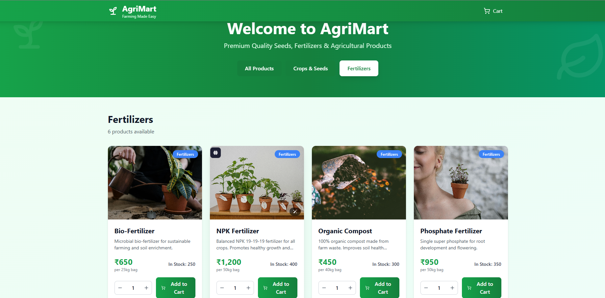
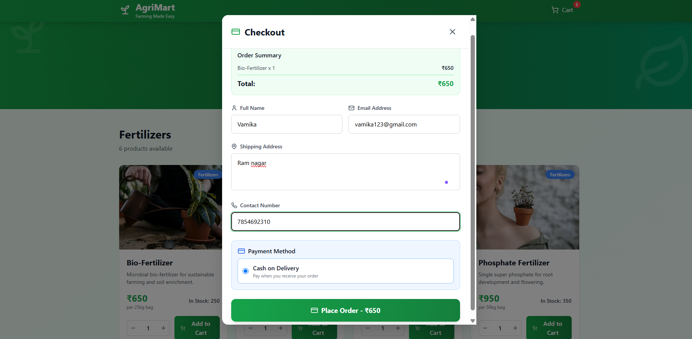

AgriMart
A digital marketplace for agricultural products where farmers can sell their produce and customers can easily browse, order, and receive fresh products at their doorstep.

## Setup

1. Clone the repository
```bash
git clone <your-repo-link>

2. Navigate to the project folder
cd agri-products-app

3. Setup the backend

If your project has a backend folder (e.g., server):
cd server
npm install          # Install backend dependencies
npm start            # Start backend server (default: http://localhost:5000)

4. Setup the frontend

Go to the frontend folder (e.g., client):
cd ../client
npm install          # Install frontend dependencies
npm start            # Start frontend (default: http://localhost:3000)

5. Open the app in your browser

Visit:

http://localhost:3000

## Tech stack used

React (TypeScript) – builds the user interface with type safety.

Vite – fast development server and build tool.

Tailwind CSS – utility-first CSS framework for quick, responsive styling.

Supabase (PostgreSQL) – backend-as-a-service for database, auth, and APIs.

ESLint – ensures clean and consistent code quality.

PostCSS – processes and optimizes CSS files.

.env – stores sensitive environment configuration (like API keys).

Screenshots

##Home Page


###Checkout page


###Order placed
